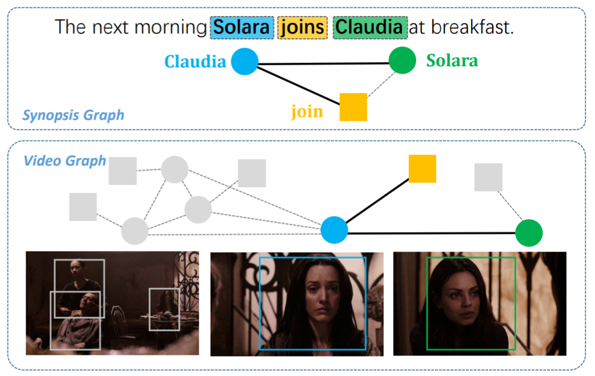
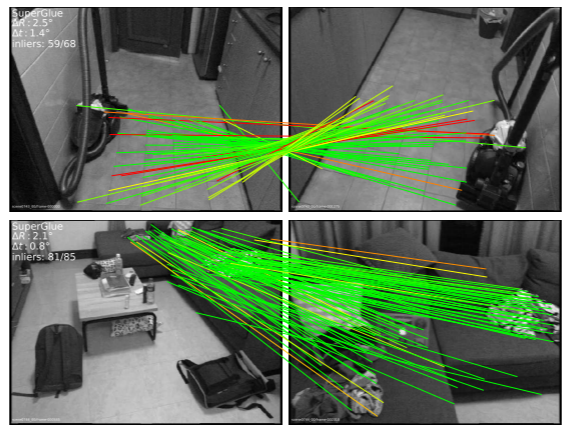

# Think Match

[](https://thinkmatch.readthedocs.io/en/latest/?badge=latest)

_ThinkMatch_ is developed and maintained by [ThinkLab](http://thinklab.sjtu.edu.cn) at Shanghai Jiao Tong University.
This repository is developed for the following purposes:
* **Providing modules** for developing deep graph matching algorithms to facilitate future research.
* **Providing implementation** of state-of-the-art deep graph matching methods.
* **Benchmarking** existing deep graph matching algorithms under different dataset & experiment settings, for the purpose of fair comparison.

## Introduction to Graph Matching
Graph Matching (GM) is a fundamental yet challenging problem in computer vision, pattern recognition and data mining. GM aims to find node-to-node correspondence among multiple graphs, by solving an NP-hard combinatorial problem named Quadratic Assignment Problem (QAP). Recently, there is growing interest in developing deep learning based graph matching methods.

Graph matching techniques have been applied to the following applications:
* [Bridging movie and synopses](https://openaccess.thecvf.com/content_ICCV_2019/papers/Xiong_A_Graph-Based_Framework_to_Bridge_Movies_and_Synopses_ICCV_2019_paper.pdf)

  

* [Image correspondence](https://arxiv.org/pdf/1911.11763.pdf)

  

* [Molecules matching](https://openaccess.thecvf.com/content/CVPR2021/papers/Wang_Combinatorial_Learning_of_Graph_Edit_Distance_via_Dynamic_Embedding_CVPR_2021_paper.pdf)

  

* and more...

In this repository, we mainly focus on image keypoint matching because it is a popular testbed for existing graph matching methods.

Readers are referred to the following survey for more technical details about graph matching:
* Junchi Yan, Xu-Cheng Yin, Weiyao Lin, Cheng Deng, Hongyuan Zha, Xiaokang Yang. "A Short Survey of Recent Advances in Graph Matching."
_ICMR 2016_.
## Deep Graph Matching Algorithms
_ThinkMatch_ currently contains pytorch source code of the following deep graph matching methods:

* [**GMN**](/models/GMN)
  * Andrei Zanfir and Cristian Sminchisescu. "Deep Learning of Graph Matching." _CVPR 2018_.
    [[paper]](http://openaccess.thecvf.com/content_cvpr_2018/html/Zanfir_Deep_Learning_of_CVPR_2018_paper.html)
* [**PCA-GM & IPCA-GM**](/models/PCA)
  * Runzhong Wang, Junchi Yan and Xiaokang Yang. "Combinatorial Learning of Robust Deep Graph Matching: an Embedding based Approach." _TPAMI 2020_.
    [[paper]](https://ieeexplore.ieee.org/abstract/document/9128045/), [[project page]](https://thinklab.sjtu.edu.cn/IPCA_GM.html)
  * Runzhong Wang, Junchi Yan and Xiaokang Yang. "Learning Combinatorial Embedding Networks for Deep Graph Matching." _ICCV 2019_.
    [[paper]](http://openaccess.thecvf.com/content_ICCV_2019/papers/Wang_Learning_Combinatorial_Embedding_Networks_for_Deep_Graph_Matching_ICCV_2019_paper.pdf)
* [**NGM & NGM-v2**](/models/NGM)
  * Runzhong Wang, Junchi Yan, Xiaokang Yang. "Neural Graph Matching Network: Learning Lawler's Quadratic Assignment Problem with Extension to Hypergraph and Multiple-graph Matching." _TPAMI 2021_.
    [[paper]](https://ieeexplore.ieee.org/document/9426408), [[project page]](http://thinklab.sjtu.edu.cn/project/NGM/index.html)
* [**CIE-H**](/models/CIE)
  * Tianshu Yu, Runzhong Wang, Junchi Yan, Baoxin Li. "Learning deep graph matching with channel-independent embedding and Hungarian attention." _ICLR 2020_.
    [[paper]](https://openreview.net/forum?id=rJgBd2NYPH)
* [**GANN**](/models/GANN)
  * Runzhong Wang, Junchi Yan and Xiaokang Yang. "Graduated Assignment for Joint Multi-Graph Matching and Clustering with Application to Unsupervised Graph Matching Network Learning." _NeurIPS 2020_.
    [[paper]](https://papers.nips.cc/paper/2020/hash/e6384711491713d29bc63fc5eeb5ba4f-Abstract.html)
  * Runzhong Wang, Shaofei Jiang, Junchi Yan and Xiaokang Yang. "Robust Self-supervised Learning of Deep Graph Matching with Mixture of Modes." _Submitted to TPAMI_.
    [[project page]](https://thinklab.sjtu.edu.cn/project/GANN-GM/index.html)
* [**BBGM**](/models/BBGM)
  * Michal Rolínek, Paul Swoboda, Dominik Zietlow, Anselm Paulus, Vít Musil, Georg Martius. "Deep Graph Matching via Blackbox Differentiation of Combinatorial Solvers." _ECCV 2020_.
    [[paper]](https://www.ecva.net/papers/eccv_2020/papers_ECCV/papers/123730409.pdf)

## Deep Graph Matching Benchmarks

### PascalVOC - 2GM

| model                                                        | year | aero   | bike   | bird   | boat   | bottle | bus    | car    | cat    | chair  | cow    | table  | dog    | horse  | mbkie  | person | plant  | sheep  | sofa   | train  | tv     | mean   |
| ------------------------------------------------------------ | ---- | ------ | ------ | ------ | ------ | ------ | ------ | ------ | ------ | ------ | ------ | ------ | ------ | ------ | ------ | ------ | ------ | ------ | ------ | ------ | ------ | ------ |
| [GMN](https://thinkmatch.readthedocs.io/en/latest/guide/models.html#gmn) | 2018 | 0.4163 | 0.5964 | 0.6027 | 0.4795 | 0.7918 | 0.7020 | 0.6735 | 0.6488 | 0.3924 | 0.6128 | 0.6693 | 0.5976 | 0.6106 | 0.5975 | 0.3721 | 0.7818 | 0.6800 | 0.4993 | 0.8421 | 0.9141 | 0.6240 |
| [PCA-GM](https://thinkmatch.readthedocs.io/en/latest/guide/models.html#pca-gm) | 2019 | 0.4979 | 0.6193 | 0.6531 | 0.5715 | 0.7882 | 0.7556 | 0.6466 | 0.6969 | 0.4164 | 0.6339 | 0.5073 | 0.6705 | 0.6671 | 0.6164 | 0.4447 | 0.8116 | 0.6782 | 0.5922 | 0.7845 | 0.9042 | 0.6478 |
| [NGM](https://thinkmatch.readthedocs.io/en/latest/guide/models.html#ngm) | 2019 | 0.5010 | 0.6350 | 0.5790 | 0.5340 | 0.7980 | 0.7710 | 0.7360 | 0.6820 | 0.4110 | 0.6640 | 0.4080 | 0.6030 | 0.6190 | 0.6350 | 0.4560 | 0.7710 | 0.6930 | 0.6550 | 0.7920 | 0.8820 | 0.6413 |
| [NHGM](https://thinkmatch.readthedocs.io/en/latest/guide/models.html#ngm) | 2019 | 0.5240 | 0.6220 | 0.5830 | 0.5570 | 0.7870 | 0.7770 | 0.7440 | 0.7070 | 0.4200 | 0.6460 | 0.5380 | 0.6100 | 0.6190 | 0.6080 | 0.4680 | 0.7910 | 0.6680 | 0.5510 | 0.8090 | 0.8870 | 0.6458 |
| [IPCA-GM](https://thinkmatch.readthedocs.io/en/latest/guide/models.html#pca-gm) | 2020 | 0.5378 | 0.6622 | 0.6714 | 0.6120 | 0.8039 | 0.7527 | 0.7255 | 0.7252 | 0.4455 | 0.6524 | 0.5430 | 0.6724 | 0.6790 | 0.6421 | 0.4793 | 0.8435 | 0.7079 | 0.6398 | 0.8380 | 0.9083 | 0.6770 |
| [CIE-H](https://thinkmatch.readthedocs.io/en/latest/guide/models.html#cie-h) | 2020 | 0.5250 | 0.6858 | 0.7015 | 0.5706 | 0.8207 | 0.7700 | 0.7073 | 0.7313 | 0.4383 | 0.6994 | 0.6237 | 0.7018 | 0.7031 | 0.6641 | 0.4763 | 0.8525 | 0.7172 | 0.6400 | 0.8385 | 0.9168 | 0.6892 |
| [BBGM](https://thinkmatch.readthedocs.io/en/latest/guide/models.html#bbgm) | 2020 | 0.6187 | 0.7106 | 0.7969 | 0.7896 | 0.8740 | 0.9401 | 0.8947 | 0.8022 | 0.5676 | 0.7914 | 0.6458 | 0.7892 | 0.7615 | 0.7512 | 0.6519 | 0.9818 | 0.7729 | 0.7701 | 0.9494 | 0.9393 | 0.7899 |
| [NGM-v2](https://thinkmatch.readthedocs.io/en/latest/guide/models.html#ngm) | 2021 | 0.6184 | 0.7118 | 0.7762 | 0.7875 | 0.8733 | 0.9363 | 0.8770 | 0.7977 | 0.5535 | 0.7781 | 0.8952 | 0.7880 | 0.8011 | 0.7923 | 0.6258 | 0.9771 | 0.7769 | 0.7574 | 0.9665 | 0.9323 | 0.8011 |
| [NHGM-v2](https://thinkmatch.readthedocs.io/en/latest/guide/models.html#ngm) | 2021 | 0.5995 | 0.7154 | 0.7724 | 0.7902 | 0.8773 | 0.9457 | 0.8903 | 0.8181 | 0.5995 | 0.8129 | 0.8695 | 0.7811 | 0.7645 | 0.7750 | 0.6440 | 0.9872 | 0.7778 | 0.7538 | 0.9787 | 0.9280 | 0.8040 |

### Willow Object Class - 2GM & MGM

| model                                                        | year | remark          | Car    | Duck   | Face   | Motorbike | Winebottle | mean   |
| ------------------------------------------------------------ | ---- | --------------- | ------ | ------ | ------ | --------- | ---------- | ------ |
| [GMN](https://thinkmatch.readthedocs.io/en/latest/guide/models.html#gmn) | 2018 | -               | 0.6790 | 0.7670 | 0.9980 | 0.6920    | 0.8310     | 0.7934 |
| [PCA-GM](https://thinkmatch.readthedocs.io/en/latest/guide/models.html#pca-gm) | 2019 | -               | 0.8760 | 0.8360 | 1.0000 | 0.7760    | 0.8840     | 0.8744 |
| [NGM](https://thinkmatch.readthedocs.io/en/latest/guide/models.html#ngm) | 2019 | -               | 0.8420 | 0.7760 | 0.9940 | 0.7680    | 0.8830     | 0.8530 |
| [NHGM](https://thinkmatch.readthedocs.io/en/latest/guide/models.html#ngm) | 2019 | -               | 0.8650 | 0.7220 | 0.9990 | 0.7930    | 0.8940     | 0.8550 |
| [NMGM](https://thinkmatch.readthedocs.io/en/latest/guide/models.html#ngm) | 2019 | -               | 0.7850 | 0.9210 | 1.0000 | 0.7870    | 0.9480     | 0.8880 |
| [IPCA-GM](https://thinkmatch.readthedocs.io/en/latest/guide/models.html#pca) | 2020 | -               | 0.9040 | 0.8860 | 1.0000 | 0.8300    | 0.8830     | 0.9006 |
| [CIE-H](https://thinkmatch.readthedocs.io/en/latest/guide/models.html#cie-h) | 2020 | -               | 0.8581 | 0.8206 | 0.9994 | 0.8836    | 0.8871     | 0.8898 |
| [BBGM](https://thinkmatch.readthedocs.io/en/latest/guide/models.html#bbgm) | 2020 | -               | 0.9680 | 0.8990 | 1.0000 | 0.9980    | 0.9940     | 0.9718 |
| [GANN-MGM](https://thinkmatch.readthedocs.io/en/latest/guide/models.html#gann) | 2020 | self-supervised | 0.9600 | 0.9642 | 1.0000 | 1.0000    | 0.9879     | 0.9906 |
| [NGM-v2](https://thinkmatch.readthedocs.io/en/latest/guide/models.html#ngm) | 2021 | -               | 0.9740 | 0.9340 | 1.0000 | 0.9860    | 0.9830     | 0.9754 |
| [NHGM-v2](https://thinkmatch.readthedocs.io/en/latest/guide/models.html#ngm) | 2021 | -               | 0.9740 | 0.9390 | 1.0000 | 0.9860    | 0.9890     | 0.9780 |
| [NMGM-v2](https://thinkmatch.readthedocs.io/en/latest/guide/models.html#ngm) | 2021 | -               | 0.9760 | 0.9447 | 1.0000 | 1.0000    | 0.9902     | 0.9822 |

_ThinkMatch_ includes the flowing datasets with the provided benchmarks:

* **PascalVOC-Keypoint**
* **Willow-Object-Class**
* **CUB2011**
* **IMC-PT-SparseGM**

**TODO** We also plan to include the following datasets in the future:
* **SPair-71k**
* **Synthetic data**

_ThinkMatch_ also supports the following graph matching settings:
* **2GM** namely **Two**-**G**raph **M**atching where every time only a pair of two graphs is matched.
* **MGM** namely **M**ulti-**G**raph **M**atching where more than two graphs are jointly matched.
* **MGM3** namely **M**ulti-**G**raph **M**atching with a **M**ixture of **M**odes, where multiple graphs are jointly considered, and at the same time the graphs may come from different categories.

## Get Started

### Docker (RECOMMENDED)

1. We maintain a prebuilt image at [dockerhub](https://hub.docker.com/r/runzhongwang/thinkmatch): ``runzhongwang/thinkmatch:torch1.6.0-cuda10.1-cudnn7-pyg1.6.3-pygmtools0.1.14``. It can be used by docker or other container runtimes that support docker images e.g. [singularity](https://sylabs.io/singularity/).
2. We also provide a ``Dockerfile`` to build your own image (you may need ``docker`` and ``nvidia-docker`` installed on your computer).

### Manual configuration (for Ubuntu)
This repository is developed and tested with Ubuntu 16.04, Python 3.7, Pytorch 1.6, cuda10.1, cudnn7 and torch-geometric 1.6.3.
1. Install and configure Pytorch 1.6 (with GPU support).
1. Install ninja-build: ``apt-get install ninja-build``
1. Install python packages:
    ```bash
    pip install tensorboardX scipy easydict pyyaml xlrd xlwt pynvml pygmtools
   ```
1. Install building tools for LPMP:
    ```bash
    apt-get install -y findutils libhdf5-serial-dev git wget libssl-dev

    wget https://github.com/Kitware/CMake/releases/download/v3.19.1/cmake-3.19.1.tar.gz && tar zxvf cmake-3.19.1.tar.gz
    cd cmake-3.19.1 && ./bootstrap && make && make install
    ```

1. Install and build LPMP:
    ```bash
   python -m pip install git+https://git@github.com/rogerwwww/lpmp.git
   ```
   You may need ``gcc-9`` to successfully build LPMP. Here we provide an example installing and configuring ``gcc-9``:
   ```bash
   apt-get update
   apt-get install -y software-properties-common
   add-apt-repository ppa:ubuntu-toolchain-r/test
   apt-get install -y gcc-9 g++-9
   update-alternatives --install /usr/bin/gcc gcc /usr/bin/gcc-9 60 --slave /usr/bin/g++ g++ /usr/bin/g++-9
   ```

1. Install torch-geometric:
    ```bash
    export CUDA=cu101
    export TORCH=1.6.0
    /opt/conda/bin/pip install torch-scatter==2.0.5 -f https://pytorch-geometric.com/whl/torch-${TORCH}+${CUDA}.html
    /opt/conda/bin/pip install torch-sparse==0.6.8 -f https://pytorch-geometric.com/whl/torch-${TORCH}+${CUDA}.html
    /opt/conda/bin/pip install torch-cluster==1.5.8 -f https://pytorch-geometric.com/whl/torch-${TORCH}+${CUDA}.html
    /opt/conda/bin/pip install torch-spline-conv==1.2.0 -f https://pytorch-geometric.com/whl/torch-${TORCH}+${CUDA}.html
    /opt/conda/bin/pip install torch-geometric==1.6.3
   ```

1. If you have configured ``gcc-9`` to build LPMP, be sure to switch back to ``gcc-7`` because this code repository is based on ``gcc-7``. Here is also an example:

    ```bash
    update-alternatives --remove gcc /usr/bin/gcc-9
   update-alternatives --install /usr/bin/gcc gcc /usr/bin/gcc-7 60 --slave /usr/bin/g++ g++ /usr/bin/g++-7
   ```

### Available datasets

Note: All following datasets can be automatically downloaded and unzipped by `pygmtools`, but you can also download the dataset yourself if a download failure occurs.

1. PascalVOC-Keypoint

    1. Download [VOC2011 dataset](http://host.robots.ox.ac.uk/pascal/VOC/voc2011/index.html) and make sure it looks like ``data/PascalVOC/TrainVal/VOCdevkit/VOC2011``
    1. Download keypoint annotation for VOC2011 from [Berkeley server](https://www2.eecs.berkeley.edu/Research/Projects/CS/vision/shape/poselets/voc2011_keypoints_Feb2012.tgz) or [google drive](https://drive.google.com/open?id=1D5o8rmnY1-DaDrgAXSygnflX5c-JyUWR) and make sure it looks like ``data/PascalVOC/annotations``
    1. The train/test split is available in ``data/PascalVOC/voc2011_pairs.npz``. **This file must be added manually.**

    Please cite the following papers if you use PascalVOC-Keypoint dataset:
    ```
    @article{EveringhamIJCV10,
      title={The pascal visual object classes (voc) challenge},
      author={Everingham, Mark and Van Gool, Luc and Williams, Christopher KI and Winn, John and Zisserman, Andrew},
      journal={International Journal of Computer Vision},
      volume={88},
      pages={303–338},
      year={2010}
    }

    @inproceedings{BourdevICCV09,
      title={Poselets: Body part detectors trained using 3d human pose annotations},
      author={Bourdev, L. and Malik, J.},
      booktitle={International Conference on Computer Vision},
      pages={1365--1372},
      year={2009},
      organization={IEEE}
    }
    ```
1. Willow-Object-Class
    1. Download [Willow-ObjectClass dataset](http://www.di.ens.fr/willow/research/graphlearning/WILLOW-ObjectClass_dataset.zip)
    1. Unzip the dataset and make sure it looks like ``data/WillowObject/WILLOW-ObjectClass``

    Please cite the following paper if you use Willow-Object-Class dataset:
    ```
    @inproceedings{ChoICCV13,
      author={Cho, Minsu and Alahari, Karteek and Ponce, Jean},
      title = {Learning Graphs to Match},
      booktitle = {International Conference on Computer Vision},
      pages={25--32},
      year={2013}
    }
    ```

1. CUB2011
    1. Download [CUB-200-2011 dataset](http://www.vision.caltech.edu/visipedia-data/CUB-200-2011/CUB_200_2011.tgz).
    1. Unzip the dataset and make sure it looks like ``data/CUB_200_2011/CUB_200_2011``

    Please cite the following report if you use CUB2011 dataset:
    ```
    @techreport{CUB2011,
      Title = {{The Caltech-UCSD Birds-200-2011 Dataset}},
      Author = {Wah, C. and Branson, S. and Welinder, P. and Perona, P. and Belongie, S.},
      Year = {2011},
      Institution = {California Institute of Technology},
      Number = {CNS-TR-2011-001}
    }
    ```

1. IMC-PT-SparseGM
    1. Download the IMC-PT-SparseGM dataset from [google drive](https://drive.google.com/file/d/1Po9pRMWXTqKK2ABPpVmkcsOq-6K_2v-B/view?usp=sharing) or [baidu drive (code: 0576)](https://pan.baidu.com/s/1hlJdIFp4rkiz1Y-gztyHIw)
    1. Unzip the dataset and make sure it looks like ``data/IMC_PT_SparseGM/annotations``

    Please cite the following papers if you use IMC-PT-SparseGM dataset:
    ```
    @article{JinIJCV21,
      title={Image Matching across Wide Baselines: From Paper to Practice},
      author={Jin, Yuhe and Mishkin, Dmytro and Mishchuk, Anastasiia and Matas, Jiri and Fua, Pascal and Yi, Kwang Moo and Trulls, Eduard},
      journal={International Journal of Computer Vision},
      pages={517--547},
      year={2021}
    }

    @unpublished{WangPAMIsub21,
      title={Robust Self-supervised Learning of Deep Graph Matching with Mixture of Modes},
      author={Wang, Runzhong and Jiang, Shaofei and Yan, Junchi and Yang, Xiaokang},
      note={submitted to IEEE Transactions of Pattern Analysis and Machine Intelligence},
      year={2021}
    }
    ```

For more information, please see [pygmtools](https://pypi.org/project/pygmtools/).

## Run the Experiment

Run training and evaluation
```bash
python train_eval.py --cfg path/to/your/yaml
```

and replace ``path/to/your/yaml`` by path to your configuration file, e.g.
```bash
python train_eval.py --cfg experiments/vgg16_pca_voc.yaml
```

Default configuration files are stored in``experiments/`` and you are welcomed to try your own configurations. If you find a better yaml configuration, please let us know by raising an issue or a PR and we will update the benchmark!

## Pretrained Models
_ThinkMatch_ provides pretrained models. The model weights are available via [google drive](https://drive.google.com/drive/folders/11xAQlaEsMrRlIVc00nqWrjHf8VOXUxHQ?usp=sharing)

To use the pretrained models, firstly download the weight files, then add the following line to your yaml file:
```yaml
PRETRAINED_PATH: path/to/your/pretrained/weights
```
